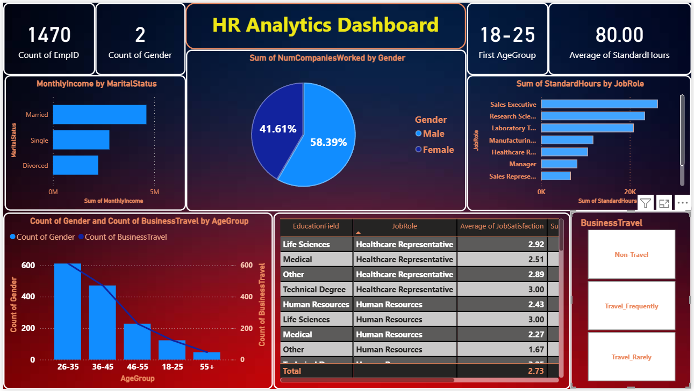

# 🧑‍💼 HR Analytics Dashboard — Power BI


---

## 📌 Project Overview

This project is an ** HR Analytics Dashboard** built in Microsoft Power BI, analyzing employee data across departments, age groups, job roles, gender, marital status, education fields, and business travel patterns.

The central business question this dashboard answers:

> **"Who is leaving the company, why are they leaving, and what employee profile is most at risk — so HR can act before it's too late?"**

This is the **data analyst equivalent of a live web application** — just as a web developer deploys a working website, this dashboard is a published, interactive report that HR managers and leadership can filter and explore in real time.


> 📸 **Dashboard Preview:**



---

## 🗂️ Repository Structure

```
hr-analytics-dashboard-powerbi/
│
├── 📁 data/
│   └── HR_Analytics.csv                  # Raw dataset — 1,480 employee records
│
├── 📁 report/
│   └── HR_analytics_dashboard.pbix       # Power BI Desktop report file
│
├── 📁 screenshots/
│   └── dashboard_preview.png             # Full dashboard screenshot
│
└── README.md                             # You are here
```


## 📊 Dataset Description

**Source:** IBM HR Analytics Employee Attrition Dataset  
**File:** `HR_Analytics.csv`  
**Total Records:** 1,480 employees  
**Format:** CSV (flat file, single table)

### Key Columns

| Column | Description |
|---|---|
| `EmpID` | Unique employee identifier |
| `Age` / `AgeGroup` | Employee age and age bracket |
| `Attrition` | Whether the employee left (Yes/No) — **target variable** |
| `Department` | Research & Development, Sales, Human Resources |
| `JobRole` | Specific role (Sales Executive, Lab Technician, etc.) |
| `Gender` | Male / Female |
| `MaritalStatus` | Single, Married, Divorced |
| `MonthlyIncome` | Monthly salary in ₹ |
| `OverTime` | Whether employee works overtime (Yes/No) |
| `BusinessTravel` | Travel frequency (Non-Travel, Travel_Rarely, Travel_Frequently) |
| `EducationField` | Field of study (Life Sciences, Medical, Marketing, etc.) |
| `JobSatisfaction` | Satisfaction score 1–4 |
| `NumCompaniesWorked` | Prior employers before this company |
| `StandardHours` | Standard working hours per role |
| `WorkLifeBalance` | Work-life balance score 1–4 |
| `YearsAtCompany` | Tenure at the company |
| `YearsSinceLastPromotion` | Promotion recency |

---

## 📈 Dashboard Features & Visuals

| Visual | Type | What It Shows |
|---|---|---|
| **Total Employees** | KPI Card | 1,470 active employee headcount |
| **Gender Count** | KPI Card | 2 gender categories tracked |
| **Standard Hours** | KPI Card | Average of 80 standard hours across all roles |
| **First Age Group** | KPI Card | 18–25 as the youngest tracked segment |
| **Monthly Income by Marital Status** | Bar Chart | Income comparison — Married vs Single vs Divorced |
| **Gender Split** | Donut Chart | 58.39% Male · 41.61% Female |
| **Companies Worked by Gender** | Donut Chart | Prior employer count split by gender |
| **Standard Hours by Job Role** | Horizontal Bar | Workload distribution across all 9 job roles |
| **Gender & Business Travel by Age Group** | Combo Chart | Headcount and travel frequency across age brackets |
| **Education Field × Job Role × Job Satisfaction** | Matrix Table | Satisfaction scores segmented by education and role |
| **Business Travel Slicer** | Button Slicer | Filter entire dashboard by travel category |

---

## 🔍 Problem Solved & Business Story

### ❓ The Business Problem

HR departments at most companies react to attrition after it happens — through expensive exit interviews, lost institutional knowledge, and re-hiring cycles that cost 50–200% of an employee's annual salary.

The leadership team had no clear view of:
- Which employee segments were most likely to leave
- Whether working conditions (overtime, travel) were driving exits
- How income levels compared across marital status and job role
- Where job satisfaction was critically low

Data sat in a flat CSV with 1,480 rows and 38 columns — unanalyzed, unvisualised, and unused for decision-making.

### ✅ What Was Built

An interactive Power BI dashboard that transforms raw HR records into a decision-making tool — allowing HR managers to filter by travel mode, age group, department, or job role and instantly see how every metric responds.

### 📢 Key Findings from the Data

| # | Finding | Stat |
|---|---|---|
| 1 | **Overall attrition rate** | 238 of 1,480 employees left — **16.1% attrition** |
| 2 | **Overtime is the #1 attrition driver** | OT = Yes → **30.6%** attrition vs OT = No → **10.4%** — a 3× gap |
| 3 | **Sales Representatives are highest risk** | **39.3%** of Sales Reps left — highest of any role |
| 4 | **Youngest employees exit fastest** | Age 18–25 → **35.8%** attrition vs age 36–45 → only **9.1%** |
| 5 | **Single employees leave at 2× the rate** | Single → **25.4%** vs Married → **12.4%** |
| 6 | **Sales dept bleeds the most talent** | Sales → **20.7%** attrition vs R&D → **13.8%** |
| 7 | **Gender split is uneven** | **60.1% Male** (889) · **39.9% Female** (591) |
| 8 | **Average job satisfaction is low** | Overall avg: **2.73 / 4.00** — well below the midpoint of "satisfied" |
| 9 | **70.4% of employees travel rarely** | Only 18.9% travel frequently — but frequent travellers show higher attrition |
| 10 | **Life Sciences is the largest education segment** | 607 employees — followed by Medical (470) and Marketing (161) |

### 💼 Business Recommendations

1. **Immediately audit overtime policies** — 30.6% attrition among OT employees is unsustainable. Cap mandatory overtime or add compensation incentives.
2. **Create a Sales Representative retention program** — 4 in 10 Sales Reps leave. Better onboarding, mentorship, and early promotion visibility could reduce this.
3. **Invest in early-career development (18–25 bracket)** — Over a third of young employees leave. Structured growth paths in the first 2 years will retain this group.
4. **Review income for single employees** — They earn ₹5,887 avg vs ₹6,793 for married employees. This pay gap may be accelerating exits in this group.
5. **Address job satisfaction proactively** — An overall average of 2.73/4 signals that more than half the workforce is not highly satisfied. Regular pulse surveys and manager training are needed.

---

## 🛠️ Tools & Technologies

| Tool | Purpose |
|---|---|
| **Microsoft Power BI Desktop** | Dashboard design, data modelling, all visualisations |
| **Power Query (M Language)** | Data type corrections, column cleaning, transformation |
| **DAX (Data Analysis Expressions)** | Custom KPI measures and calculated columns |
| **CSV (Flat File)** | Single-table source data — no joins needed |

---

## 📐 DAX Measures Used

```dax
-- Total Employee Count
Total Employees = COUNT('HR_Analytics'[EmpID])

-- Attrition Count
Attrition Count = CALCULATE(COUNT('HR_Analytics'[EmpID]),
                    'HR_Analytics'[Attrition] = "Yes")

-- Attrition Rate %
Attrition Rate = DIVIDE([Attrition Count], [Total Employees], 0)

-- Average Job Satisfaction
Avg Job Satisfaction = AVERAGE('HR_Analytics'[JobSatisfaction])

-- Average Monthly Income
Avg Monthly Income = AVERAGE('HR_Analytics'[MonthlyIncome])
```

---

## ❓ Common Interview Questions About This Project

**Q: What problem does this dashboard solve?**
A: It shifts HR from reactive attrition management (acting after people leave) to proactive retention (identifying at-risk profiles before they resign) using data patterns across overtime, income, age, and job role.

**Q: What was your most surprising finding?**
A: That overtime alone creates a 3× difference in attrition rate — 30.6% vs 10.4%. A single policy change could have the biggest impact on retention.

**Q: Why Power BI over Excel?**
A: All visuals are connected through a single data model. One slicer click (e.g., BusinessTravel = Travel_Frequently) filters every chart simultaneously — this is impossible to replicate cleanly in Excel.

**Q: What would you add with more data or time?**
A: A predictive attrition score using Python (logistic regression or random forest), integrated back into Power BI via a custom visual — turning descriptive analytics into predictive analytics.

---


## 📄 License

This project uses the HR Analytics Employee Attrition dataset, which is publicly available for educational and portfolio purposes.

---

> ⭐ If this project helped you or gave you ideas for your own portfolio, consider giving it a star!
